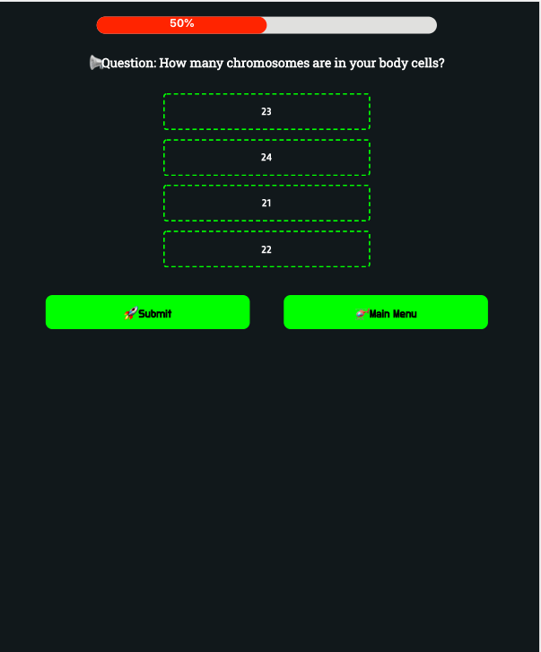

# Quiz Game

 &nbsp;&nbsp;&nbsp;&nbsp; &nbsp;&nbsp;&nbsp;&nbsp;&nbsp;&nbsp; 

## 🎯 Project goal

- The project was to create a responsive and beautiful web app with API integration which can be used to built quiz game.

## 🔥 Features/Services it provides

- 👉 API integration
- 👉 Beautiful, modern and responsive web UI
- 👉 The frontend is interactive and client side rendered
- 👉 User can select any category out of 13 and can select a difficulty level and will get 10 questions and at end you will get your results.
- 👉 Once user has selected any option in a question then he/she cannot select any other option.

## 🍕 Solution

- ✅ React is used for frontend and Sass is used for styling
- ✅ For frontend UI design Figma is used
- ✅ Open Trivia DB public api is used
- ✅ The project is built in two versions both are exactly same except for programming languages use 1) JavaScript and 2) TypeScript

## Images

